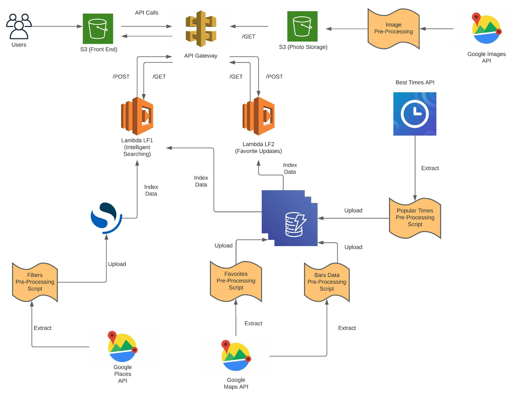

# DrinkEasy

## Description

DrinkEasy is a web app designed to make socializing easier for NYC. 
The app collects data about bars/clubs near the user or a location of the user’s choice and makes smart suggestions based on relevant filtering criterion such as 
the level of crowdedness, operating times, user reviews, ratings and lgbtq friendliness. The aim here is to empower the users to make efficient and faster decisions about the places that they want to visit based on the most important parameters.

## Architecture Diagram

## Tech Stack

The technical stack that has been used for the project is:
1. ReactJS for FrontEnd
2. AWS Lambda Functions (Written in Python 3) for BackEnd
3. AWS DynamoDB for Database

## Architecture Components

1. S3 (Front End) : It is used to host the frontend of the application. 

2. API Gateway : It is used to define API calls for the application and acts as an interface between the frontend and the lambda functions. 

3. S3 (Photo Storage) : It is used to store the images of the establishments referenced by the unique place_id.

4. Lambda LF1 (Intelligent Searching) : It is used to support zipcode based queries, filtering and categorization queries.

5. Lambda LF2 (Favorite Updates) : It is used to support ‘favorite’ functionality and for fetching favorites for a particular user.

6. DynamoDB : It is used to store data relevant to the application. Full description of the tables is shown under the database model section.

7. OpenSearch : It is used to store all the filtering information applicable to our use case. This is done as such as it’s faster to retrieve the bar IDs based on the filtering criterions first and then getting the full data. The data for this is fetched using multiple API calls to the Google Places API as explained below.

8. Google Places API : Mainly used for getting all the data for the bars. This data is stored in the Dynamo DB according to the key for the bars. We can filter out all the bars from the Google Places stored and store all the data in the DynamoDB beforehand. This is done to optimize the time needed for searching for the bars according to the filter stated by the user. The data would primarily include the following (for each bar):
Key for the Bars: Used as a primary key to retrieve some particular bars.
Zip Code: zip code in which the bar is stated.
Geolocation coordinate: latitude and longitude data for the bar location.
Name of the bar
Complete address of the bar
Open Hours
User’s Rating
Phone Number/s
How Costly? This tells us how costly the place is. Numeric (1-5, 5 being exorbitant)
LGBTQ Friendliness (Gradation = 1-5)
Link to Google Search
Associated Tags
Associated Photos
The ‘key’, ‘zip code’ and ‘geolocation’ attributes are used as a “Composite Primary key” for optimized data retrieval.

9. Google Maps API : Mainly used for mapping the user entered zip code to the actual geolocation coordinates. This is in turn used to key the data in the elastic search database for retrieving the nearest coordinates.
This gives us the following data:
Location or Zip Code: This is key here as according to this we get the geolocation coordinates.
Geolocation coordinates: This gives us the actual coordinates of the location. This is used to map the coordinates entered by the user (user location in terms of zip code) to the geolocation coordinates. 

10. BestTimes API : This is the data that tells us the crowdedness of the bar at some point in time. This gives us the full popular times map for a day (using data analysis). This data is scraped according to location entered by the user. Initially the mapping is taken from the API through calling the API link. The data is linked by the place IDs to busy hours, and the crowdedness level for the busy hours is stored as peak hours. This mapping is retrieved through the API calls and is remapped to the place IDs for the data retrieved. The data would include:
Bar Key
Bar Name
Popular Times Map (for each hour of the open hours) - Crowdedness level for an hour in the day is suggested by a numeric value in the range of 0-5. It is stored as a string of 24 characters, each character suggesting the crowdedness level for an hour of the day.
The Popular Times Map or the crowdedness level is also shown in the UI of our website. This data is retrieved from the API and filtered on the basis of the bar keys (a part of the primary key for the data stored in the DynamoDB).

11. Google Images API : Used for obtaining the cover images corresponding to each of the venues on the frontend. Once the data for each of the venues is collected through the Google Maps API, the unique URL for the cover image of the venue is stored in DynamoDB. This unique URL can then be used to retrieve the actual photos through calling the Google Images API. In turn, all of the images fetched using the API calls are then stored in a S3 bucket and the name of the images is the same as the bar ID. This naming system facilitates efficient retrieval of the image from the S3 bucket. 
